 The series of over 50 images compose a reflective portrait of my host, Monica, while on a four-week placement at her family home in Aiud, Romania.
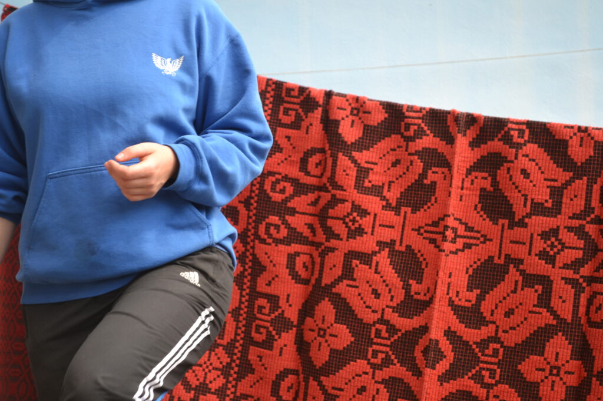
The home and surrounding farm is cared-for by three generations of Monica's family, working cooperatively within their village to cultivate land though-out the year.

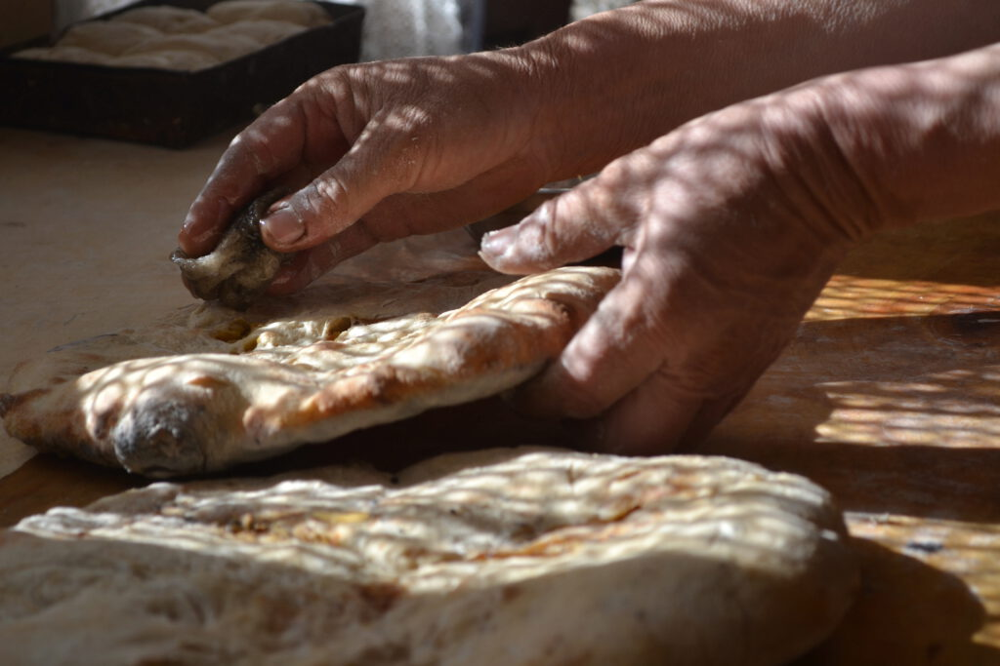
My placement in Romania marked an important step towards the environmental-domestic practice as both site and concept.

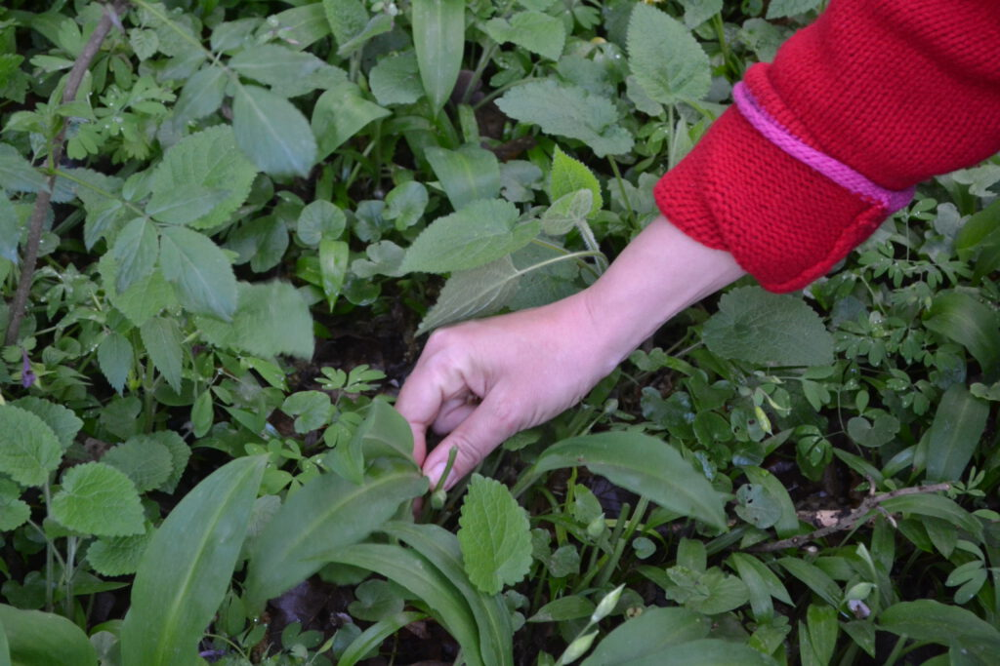
 Living alongside Monica and her family encouraged a tender sensitivity to space and place which has resonated within my work in the years following.
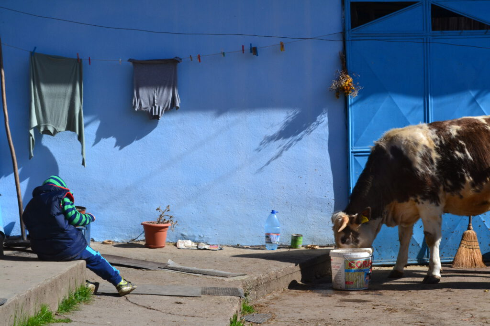
 The occupation of a space grew beyond its physicality; extending the mind, memories, and emotions ot a person to the landscapes that surround them, each an extension of the other.

Though the placement occurred over four years ago, I have found myself consistently returning to the photographs, poetry, and diaries I had made throughout my time there.

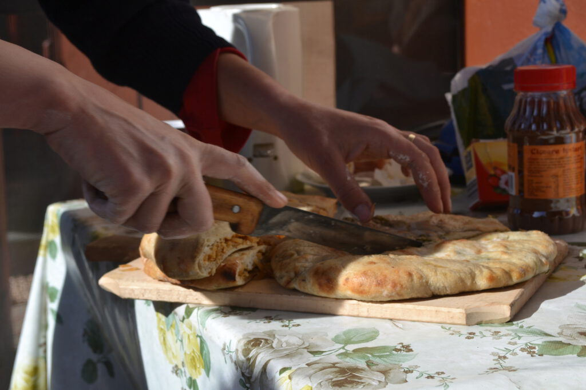
 The work I produced over four weeks has followed me through-out my developing practice and supported immeasurable progress over the years since my return.

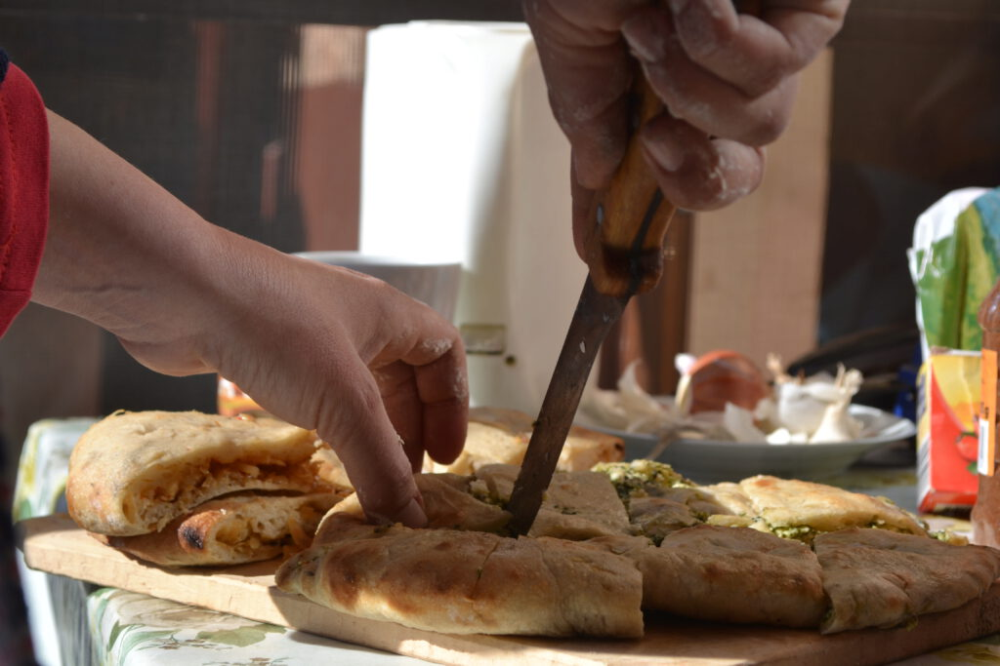
 I now understand my practice to be deeply rooted in the environment I am surrounded with; finding incredible energy an responsiveness within environments and spaces I am given time to connect with.

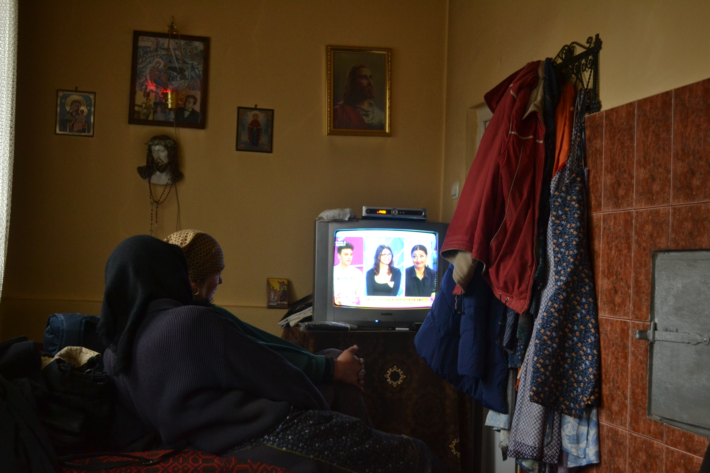

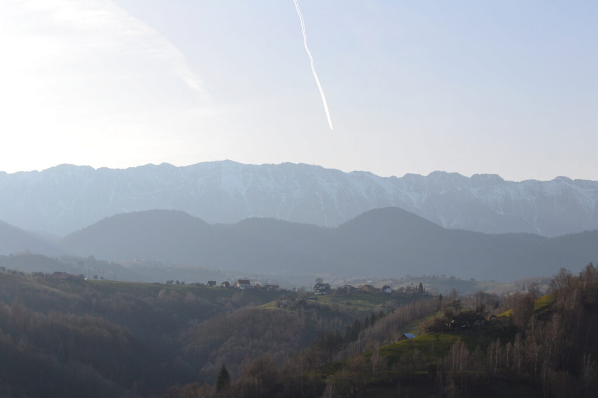

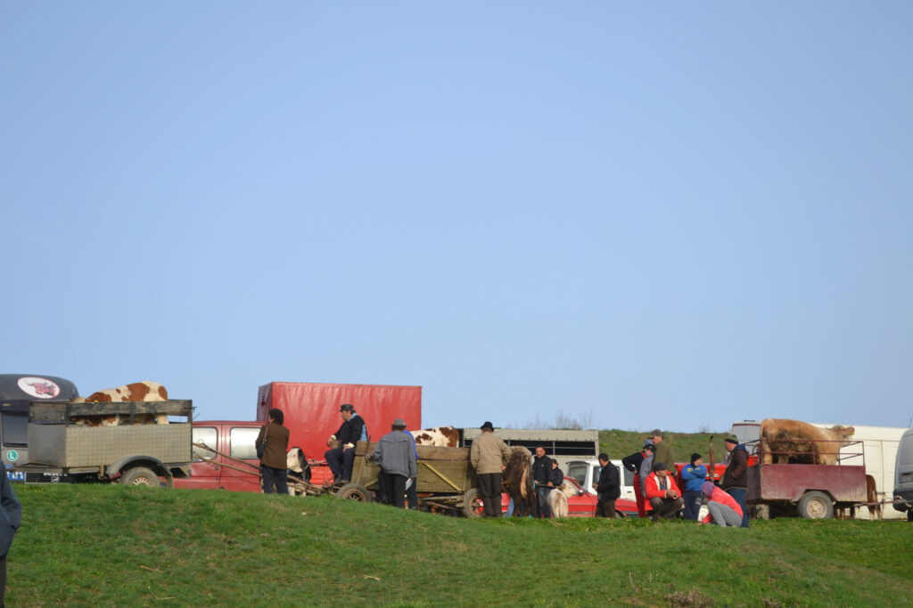

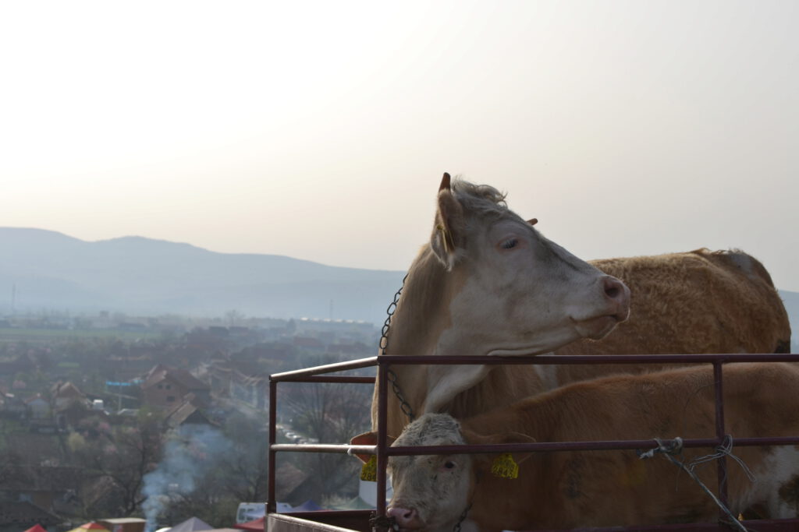

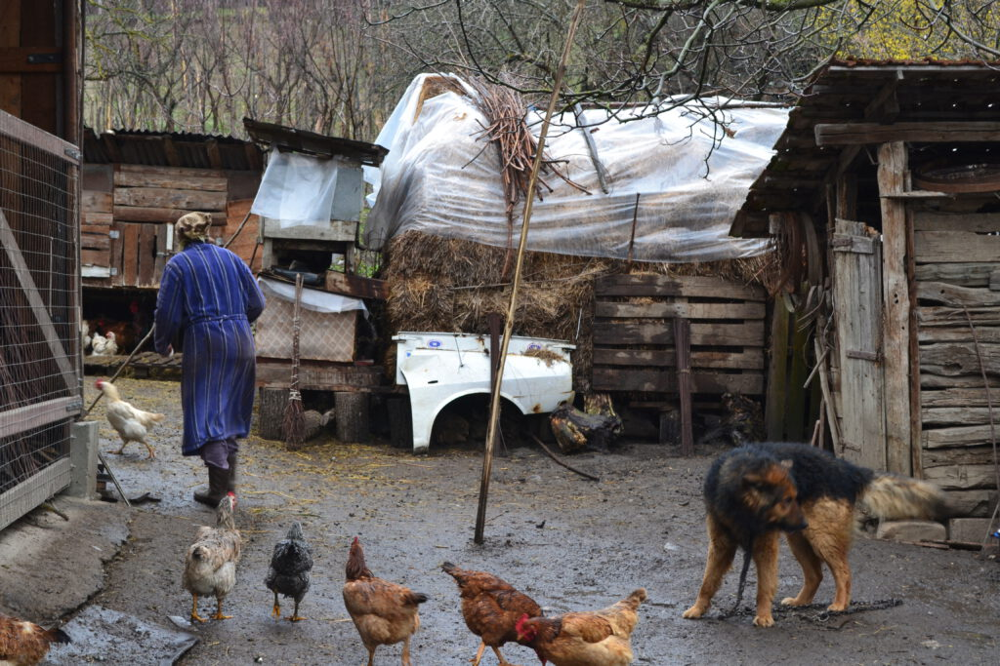

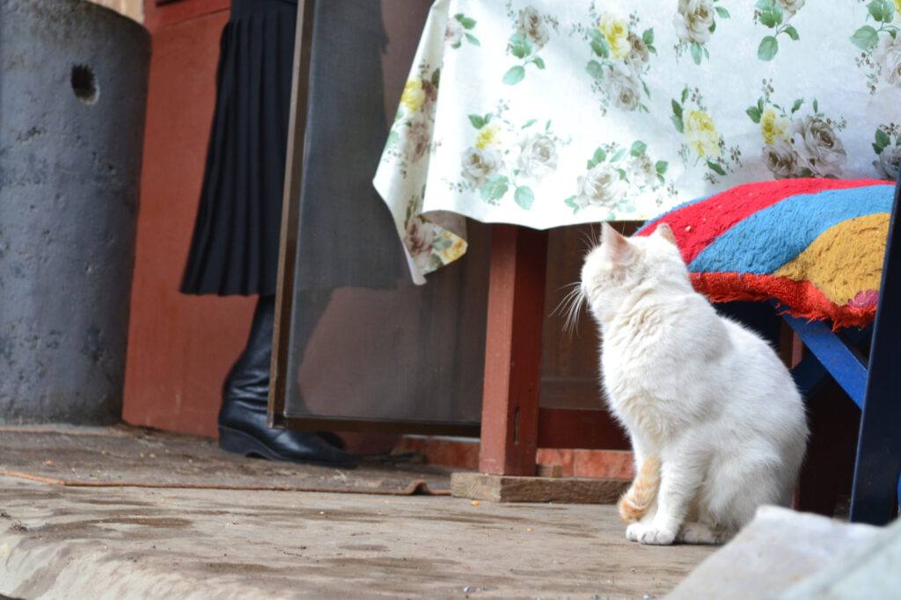

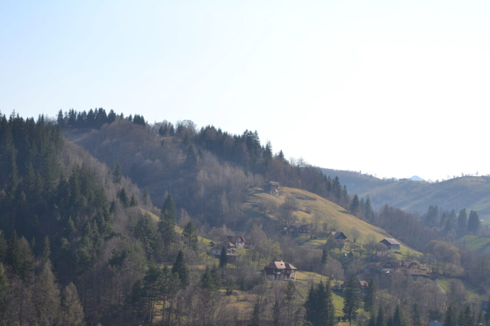

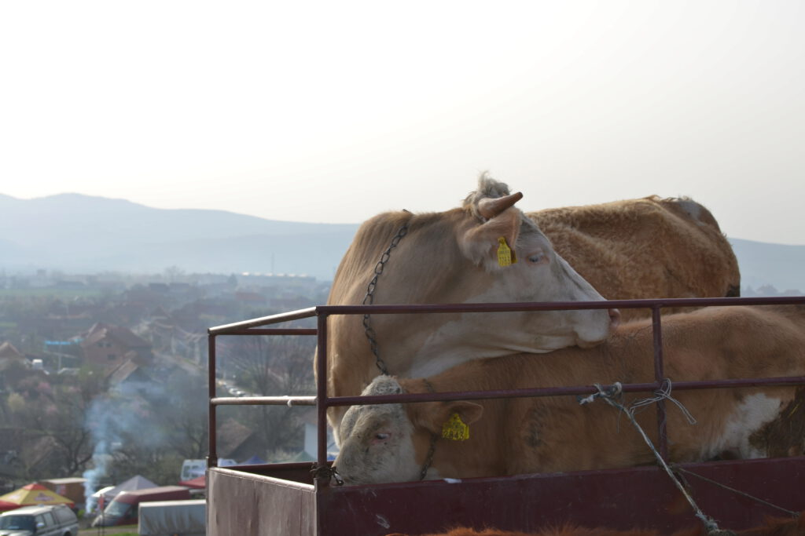

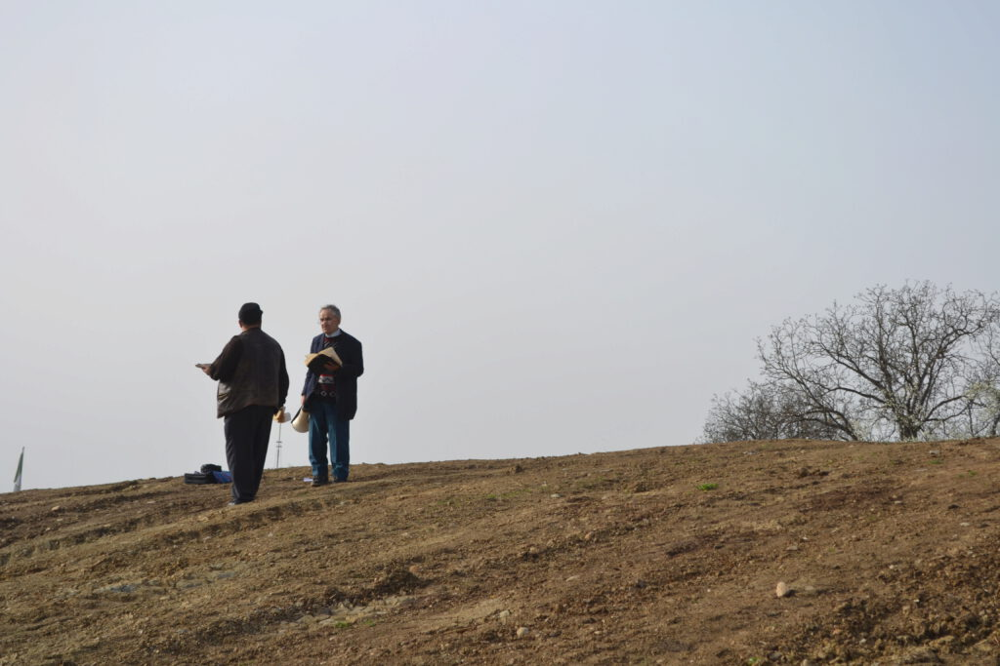
