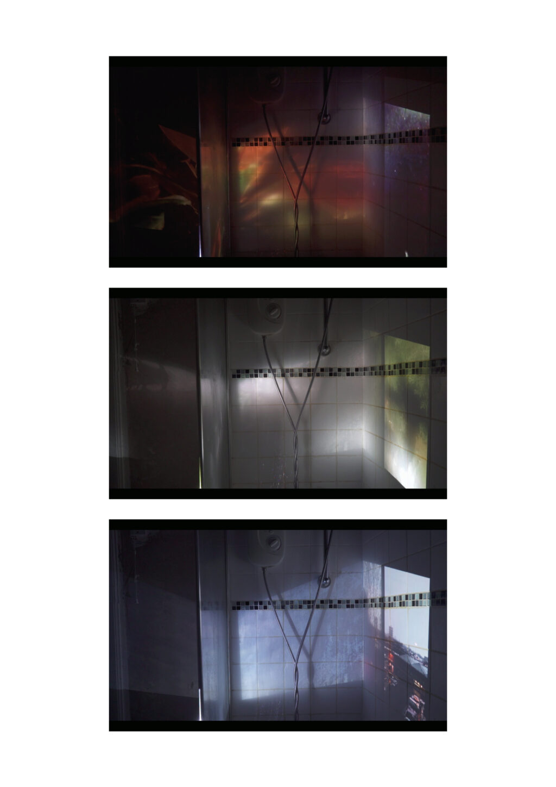

# Eclipse
## Artists Residence
### 2018

Projected cityscapes of streets, houses, and rooms are seen through running water of a shower, the image distorted and refracted across the room as it passes through a glass shower-screen and tiles of a bathroom. Reimagining the bathroom as a cognitive space where the mind may place and settle experiences from the consciousness, the installation seeks to replay moments and memories of the body within the space we tend and care for it.

