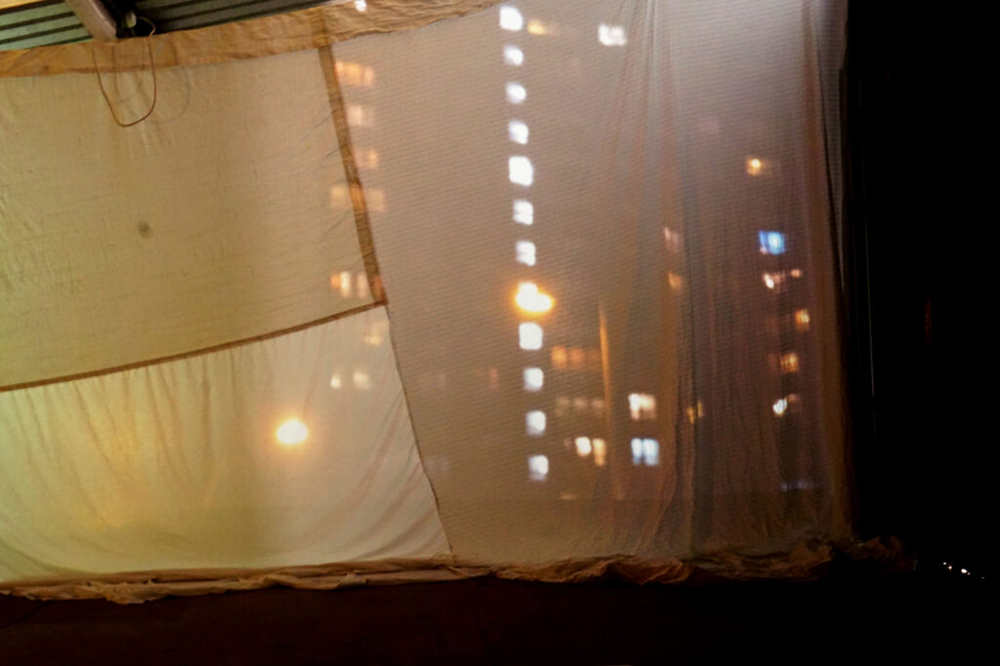

# Lamp Light
## Architectural Installation
### 2019
### House for an Art Lover, Bellahouston Park
### Fabric sheets, bed-side lamp, projector

Two fabric walls create a passageway connecting and separating two spaces, concealing and revealing each side as you walk through. 

On one side cityscapes projected through fabric walls show lit windows of high-rise flats and tenement buildings, on the other sits a lamp, lighting the passageway and illuminating the entrance with warm light. 

The installation attempted to create a threshold between outside and inside, using domestic objects to mirror the projected footage on the opposing side of the installation. 

