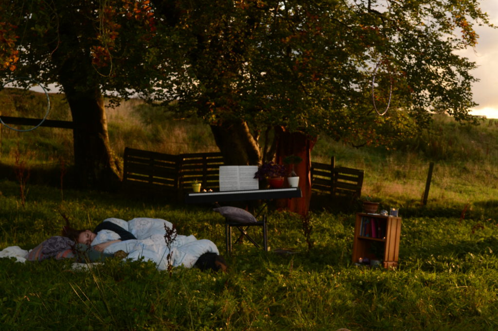

# Let's all move one place on,
## Public Installation
### 2018
### Aldhouse Nature Reserve
#### Domestic objects: piano, mattress, bedsheets, pillows, bookshelf, books, potted plants, stationary, candles, blankets, carpet 

The artwork re-homes domestic objects of a bedroom within an unoccupied field aside a main-road, inviting passers-by to a voyeuristic presence into the private space of a home. Installed for eight hours, the work accompanies passers-by as they head to and from work, walking their dogs, or running errands. 

The artwork attempts to explore the physical and cognitive dimensions of a room, bringing objects of intimate identities to a public-space transcending boundaries and ownership.
Asking if the nature of a room is defined by its walls, its objects, or its occupiers, the artwork attempts to extend the boundaries of inside/outside, public/private, myself/another beyond the physical dimensions they may have. Understanding these dichotomies as cognitive and psychological spaces rather than physical or ‘actual’ spaces, the artwork functions as an intimate intervention to the surrounding public space.